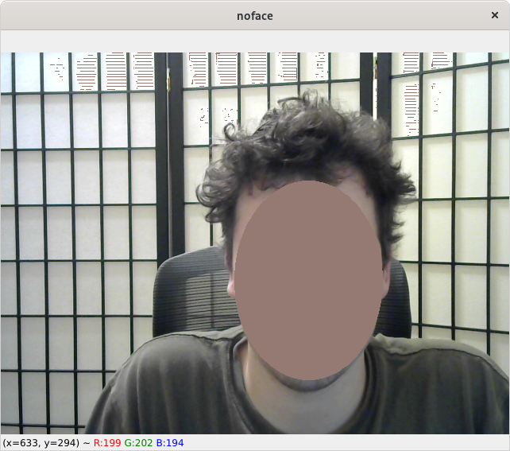

# Description

this program finds a faces using dlib and creates an ellipse mask with a flesh tone over the persons face. its not very good as is. theres a few things that need to get done. 

# get the code

```
git clone https://github.com/DrAtomic/no-face.git
cd no-face
pip install -r requirements.txt
```

# run the code

```
python src/detect_face.py
```

# example



## note
i intentionally pushed the landmarks data because i thought it was hard to find. when you google "dlib landmarks data set" you get a bunch of tutorials and none of them have the data set either. 
